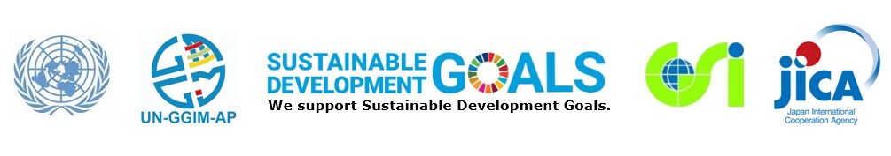

# General information
English/[日本語](ja)

## Information about the novel Corona virus situation
The local Host would like to inform the novel Corona virus situation in Japan, as of 19 February. According to the official information from the Ministry of Health, Labour and Welfare of Japan, the total number of patients in Japan is 59 including 1 death. Among them 10 patients was found from residents of Tokyo metropolis. The other mass media tells the number of patients over 600 in Japan, but most of them were found in a cruise ferry and they are isolated.

During the conference, we will prepare anti-virus hand wash and also provide sanitary masks at the venue. 

We hope this information will help you. We will also let you know any updates as soon as possible if we have any change on the conference.

## [Programme](programme.pdf), updated on 20 February 2020

## Objectives

We aim at **capacity building** such as **sharing knowledge** and **technology transfer**.

## Theme

How geospatial information and related technologies are utilized to share disaster related information and disaster risk information.

## [Concept Note](concept_note.md)

## Date

25-27 February 2020

## Venue

International Conference Hall, [JICA Global Plaza](access.pdf), Tokyo

## Draft agenda as of 7 February 2020 ([PDF](agenda.pdf))
### DAY 1 Tuesday 25 February 2020: Seminar (all day)

1. Opening & Welcome Address
2. Keynote Lecture
3. Session 1 *Contribution of Geodesy and Geospatial Information to Disaster Risk Reduction*
4. Session 2 *Utilization of Geospatial Information by Stakeholders of Disaster Risk Reduction*
5. Session 3 *Disaster Response and Building Resilience using Geospatial Information*

Welcome reception

### DAY 2 Wednesday 26 February 2020: Seminar (am) and Exercise (pm)

<ol start='6'>
 <li>Session 4 <i>Geospatial Technology against Disasters</i></li>
 <li>Wrap-up - Conclusive Words -</li>
</ol>

Scenario-based Exercise on Web-based Disaster Information Sharing

### DAY 3 Thursday 27 February 2020: Technical Tour (all day)
The [Technical Tour](technical_tour.pdf) is for the employees of governments and internatioal organizations only. 

# Registration
Registration has been closed on 13 February 2020. 
